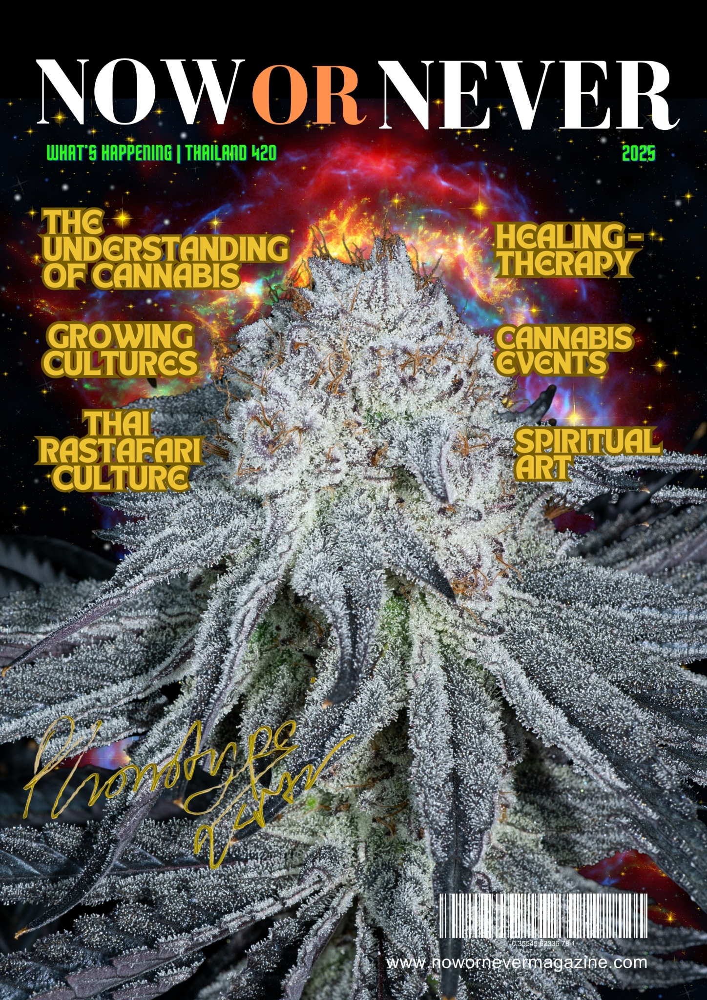

# 🖼️ SIMPLE IMAGE OPTIMIZATION GUIDE

## 🚨 **SCRIPT ISSUE FIXED**

The PowerShell script had syntax errors. Let's use a **simpler, more reliable approach**:

## 🛠️ **METHOD 1: ONLINE TOOLS (RECOMMENDED)**

### **Step 1: Go to TinyPNG/TinyJPG**
- Visit: https://tinypng.com/
- This is the **safest and most reliable** method

### **Step 2: Optimize Your Largest Images**
Upload these images one by one:

**Priority 1 (Biggest Impact):**
1. `hero-background.jpg` (~2MB) → Should become ~500KB
2. `MagazineCover.jpg` (~1.5MB) → Should become ~300KB

**Priority 2 (Gallery Images):**
3. `hightimes1.jpg` (~1.2MB) → Should become ~200KB
4. `hightimes2.jpg` (~1.1MB) → Should become ~200KB
5. `hightimes3.jpeg` (~1.3MB) → Should become ~200KB
6. `hightimes4.jpeg` (~1.4MB) → Should become ~200KB

### **Step 3: Download Optimized Images**
- Download each optimized image
- Save them to `image/optimized/` folder
- Keep the same filenames but add `-opt` suffix

### **Step 4: Test Quality**
1. Open your website
2. Compare original vs optimized images
3. Check on mobile devices
4. If quality looks good, proceed to replace

## 🛠️ **METHOD 2: FIXED SCRIPT (ALTERNATIVE)**

If you want to try the script again:
```bash
# Run the fixed script:
optimize-images-fixed.bat
```

## 🛠️ **METHOD 3: MANUAL PHOTOSHOP/GIMP**

1. Open image in Photoshop/GIMP
2. Go to File → Export → Export As
3. Set quality to 80-85%
4. Save as optimized version

## 🧪 **TESTING PROCESS**

### **Step 1: Create Test Page**
Create a simple test HTML file to compare images:

```html
<!DOCTYPE html>
<html>
<head>
    <title>Image Quality Test</title>
</head>
<body>
    <h2>Original vs Optimized</h2>
    
    <h3>Hero Background</h3>
    <p>Original:</p>
    
    
    <p>Optimized:</p>
    
    
    <h3>Magazine Cover</h3>
    <p>Original:</p>
    
    
    <p>Optimized:</p>
    
</body>
</html>
```

### **Step 2: Compare Quality**
- Open the test page in your browser
- Compare side by side
- Check on mobile device
- If quality is acceptable, proceed

### **Step 3: Replace Originals (If Quality Good)**
```bash
# Backup originals first
copy image\hero-background.jpg image-backup\hero-background-original.jpg
copy image\MagazineCover.jpg image-backup\MagazineCover-original.jpg

# Replace with optimized versions
copy image\optimized\hero-background-opt.jpg image\hero-background.jpg
copy image\optimized\MagazineCover-opt.jpg image\MagazineCover.jpg
```

## 📈 **EXPECTED RESULTS**

### **Before Optimization:**
- Total size: 16.8 MB
- Page load time: Slow

### **After Optimization:**
- Total size: 3-5 MB (70% reduction!)
- Page load time: Much faster
- Better mobile performance

## 🚀 **QUICK START (RECOMMENDED)**

1. **Go to https://tinypng.com/**
2. **Upload `hero-background.jpg` first**
3. **Download optimized version**
4. **Test in your browser**
5. **If quality is good, replace original**
6. **Repeat for other large images**

## ⚠️ **SAFETY NOTES**

- ✅ **Backups created**: All originals in `image-backup/`
- ✅ **Test first**: Always test before replacing
- ✅ **Keep originals**: Don't delete until 100% satisfied
- ✅ **One at a time**: Replace images gradually

**Which method would you prefer? Online tools (easiest) or the fixed script?**
